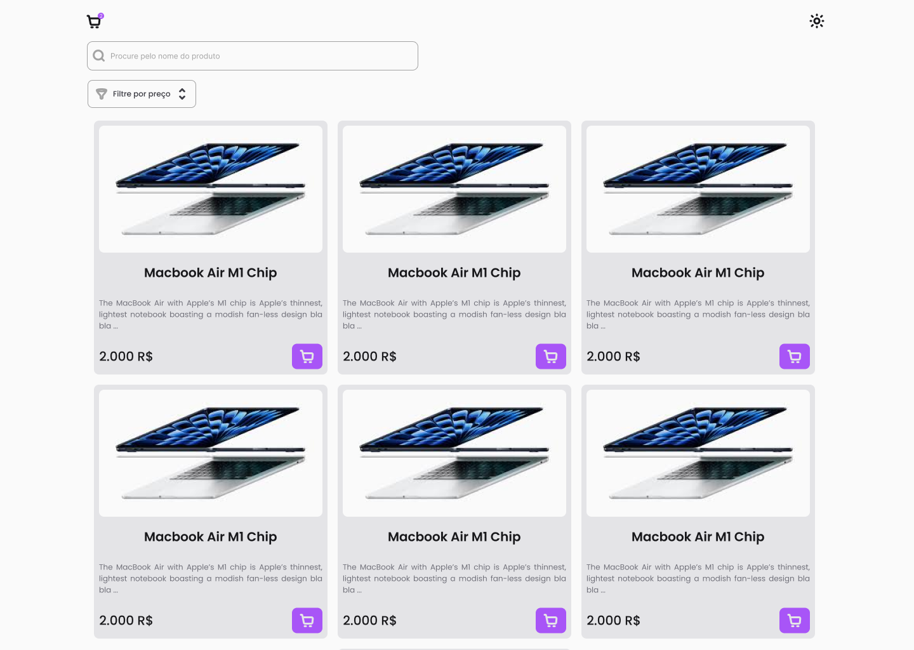

# Small Store

<div align="center" style="display: inline_block">
  
</div>

## Deploy & Design 

Para que eu pudesse me guiar eu desenvolvi o design no Figma deste projecto, apenas para me basear, nem tudo é como está no Figma mas o Deploy pode ser visto. Seguem os Links:

**Design:** [Link para o Design](https://www.figma.com/design/Y7UbCIJuxA8o8YpK9CRfap/SmallStoreTT?node-id=1-3&t=kUlPrC3KPAEi7JZ3-1)

**Deploy:** [Link para o Deploy](https://smallstore-tt.vercel.app/)

## Descrição do Projeto
Small Store é uma aplicação web de uma pequena e simples loja online que permite aos usuários visualizar produtos, adicionar itens ao carrinho, remover itens do carrinho e finalizar a compra. O projeto foi desenvolvido com React.js, Typescript e tailwind e utiliza contextos para gerenciar o estado global da aplicação.

## Funcionalidades

- **Visualização de Produtos:** Os usuários podem visualizar todos os produtos disponíveis na loja, incluindo detalhes como nome, preço, descrição e imagem.

- **Adicionar ao Carrinho:** Os usuários podem adicionar produtos ao carrinho a partir da página de visualização de produtos ou da página de detalhes do produto.

- **Remover do Carrinho:** Os usuários podem remover produtos do carrinho diretamente na página do carrinho.

- **Atualização do Carrinho:** O carrinho é atualizado em tempo real à medida que os usuários adicionam ou removem itens.

- **Finalização da Compra:** Os usuários podem finalizar a compra na página do carrinho, onde podem revisar os itens, visualizar o total da compra e inserir informações de pagamento.

## Tecnologias Utilizadas

- **React.js:** O projeto foi desenvolvido utilizando o framework React.js com TypeScript, devido à sua eficiência na criação de interfaces de usuário interativas e reativas, além da segurança proporcionada pelo TypeScript com tipagem estática.

- **React Router:** Para o roteamento da aplicação, foi utilizado o React Router para permitir a navegação entre diferentes páginas de forma declarativa e eficiente.

- **Context API:** A Context API do React foi utilizada para gerenciar o estado global da aplicação, permitindo o compartilhamento de dados entre componentes sem a necessidade de props intermediárias. O uso do TypeScript proporciona uma melhor experiência de desenvolvimento, com tipagem estática e autocompletar de código.

- **Tailwind CSS:** Para a estilização da aplicação, foi utilizado o Tailwind CSS, um framework de utilitários CSS que permite a criação de estilos de forma rápida e consistente. Com o Tailwind, é possível criar layouts responsivos e customizados de forma eficiente.

## Como Executar o Projeto

1. Clone o repositório para sua máquina local:
   ```
   git clone https://github.com/clemilsonazevedo/small-store.git
   ```

2. Navegue até o diretório do projeto:
   ```
   cd small-store
   ```

3. Instale as dependências:
   ```
   pnpm install
   ```

4. Inicie o servidor de desenvolvimento:
   ```
   pnpm dev
   ```

5. Acesse a aplicação no navegador:
   ```
   http://localhost:5173
   ```

## Autor

Small Store foi desenvolvido por [Clemilson Azevedo](https://github.com/ClemilsonAzevedo).
